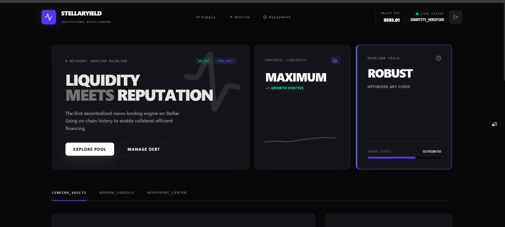

# 🌌 StellarYield: Micro-Lending Protocol

  

**StellarYield** is a decentralized, reputation-based lending platform built on the **Stellar Network** using **Soroban Smart Contracts**. It solves the problem of high collateral in DeFi by using a user's on-chain history to lower interest rates—defying the "gravity" of traditional high-interest debt.

---

## 🚀 The Vision: "Antigravity" Lending
In traditional finance, everyone pays the same high rate regardless of loyalty. In StellarYield, your **Stellar Trust Score** acts as your financial identity. The better your history, the lower your interest rate.

## 🚀 Project Links & Verification
- **🌐 Live MVP Demo:** [stellar-yield-rose.vercel.app](https://stellar-yield-rose.vercel.app/)
- **🔍 On-Chain Verification (Stellar Expert):** [Contract ID Explorer](https://stellar.expert/explorer/testnet/contract/CB4LDGHHLIFULYQPMKZCN6QD3FOZE7BANAF2LYIPYFQLDD3VDQJWFGCL)
- **💻 GitHub Repository:** [github.com/sylvia-barick/StellarYield](https://github.com/sylvia-barick/StellarYield)

### 🧠 The Reputation Engine
We use the **Stellar Horizon API** to analyze:
1. **Account Age:** Loyalty and long-term commitment to the network.
2. **Network Activity:** Total transaction count and engagement level.
These factors combine into a dynamic **Trust Score (0-100)**.

---

## 📐 Economic Model (The Formula)
We use a Linear Scaling Formula to ensure absolute transparency. Every user can verify exactly why they are paying their specific rate.

**The Equation:**
 > **Personalized Interest Rate** = `Base Rate (15%)` - (`Trust Score` / 100 × `Max Reputation Discount (10%)`)

### Example Scenarios:
| User Type | Trust Score | Calculation | Final APR |
| :--- | :--- | :--- | :--- |
| **New Account** | 0 | 15% - (0 × 10%) | **15% (Base Rate)** |
| **Active Developer** | 90 | 15% - (0.9 × 10%) | **6% (Elite Rate)** |
| **Stellar Whale** | 100 | 15% - (1.0 × 10%) | **5% (Minimum Floor)** |

## 👥 User Validation & Onboarding
To validate the MVP, we onboarded 6 testnet users to verify the end-to-end liquidity lifecycle and "Antigravity" interest scaling.

- **User Feedback Data (Excel):** [View Spreadsheet of Responses](https://docs.google.com/spreadsheets/d/1_pxFn-fNdMikKCbjyV5wrrjBzYCOKOajp6D3dPO1CCY/edit?usp=sharing)
- **Verified Testnet Users:**
  1. Debojyoti De Majumder
  2. Debdeepa Dutta
  3. Diptomoy Das
  4. Sriz Debnath
  5. Rohan Kumar
  6. Tanmay Chakraborty

---

## 🏗️ Technical Architecture
1. **Frontend:** Next.js & Framer Motion (for smooth "Antigravity" UI animations).
2. **Smart Contract:** Soroban (Rust) handling the **Stellar Asset Contract (SAC)** for real XLM transfers.
3. **Data Layer:** Horizon API for real-time identity verification.
4. **Wallet:** Integration with **Freighter** for secure transaction signing.

---

## 🌊 System Flowchart
1. **CONNECT:** User links Freighter wallet.
2. **SCAN:** Reputation Engine pings Horizon API to calculate Trust Score.
3. **SUPPLY:** User deposits XLM into the Native Core Vault.
4. **BORROW:** User takes a loan at a personalized rate.
5. **REPAY:** User clears debt in the Repayment Center to maintain their score.

---

## 🛠️ How to Use This Website

### 1. Initialize Your Identity
* Open the website and click **Connect Wallet**.
* Ensure you are on the **Stellar Testnet**.
* Watch your **Trust Score** animate based on your actual account history.

### 2. Supplying Liquidity (Lending)
* Enter an amount in the **Input Value** box (e.g., 25 XLM).
* Click **Initialize Supply** and approve the Freighter popup. Your XLM is now earning yield in the Vault!

### 3. Borrowing
* Navigate to the **Borrow Console**.
* View your **Personalized APR** (e.g., 6% if your score is 90).
* Enter the amount you need and click **Borrow**.

### 4. Repaying (Repayment Center)
* Go to the **Repayment Center**.
* View your "Total to Return" (Principal + Accrued Interest).
* Click **Clear Debt** to finalize the transaction and restore your credit line.

---

## 🔑 Key Technical Details
- **Contract ID:** `CB4LDGHHLIFULYQPMKZCN6QD3FOZE7BANAF2LYIPYFQLDD3VDQJWFGCL`
- **Network:** Stellar Testnet
- **Token:** Native XLM (SAC)
- **Precision:** 7 Decimal places (Stroops)

---
